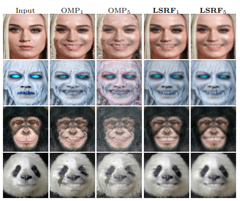

# LSRF: Localized and Sparse Receptive Fields for Linear Facial Expression Synthesis based on Global Face Context 
In: Multimedia Tools and Applications (MTAP) Under Review (2023)

<p align="center"></p>

This repository provides the official implementation of the following paper:
> **LSRF: Localized and Sparse Receptive Fields for Linear Facial Expression Synthesis based on Global Face Context**<br>
> [Arbish Akram](https://arbishakram.github.io/) and [Nazar Khan](http://faculty.pucit.edu.pk/nazarkhan/) <br>
> Department of Computer Science, University of the Punjab, Lahore, Pakistan.<br>
> **Abstract:** *Existing generative adversarial network-based methods for facial expression synthesis require larger datasets for training. Their performance drops noticeably when trained on smaller datasets. Moreover, they demand higher computational and spatial complexity at testing time which makes them unsuitable for resource-constrained devices. To overcome these limitations, this paper presents a linear formulation to learn Localized and Sparse Receptive Fields (LSRF) for facial expression synthesis considering global face context. In this perspective, we extend the sparsity-inducing formulation of the Orthogonal Matching Pursuit (OMP) algorithm with a locality constraint to ensure that i) each output pixel observes a localized region and ii) neighboring output pixels attend proximate regions of the input face image. Extensive qualitative and quantitative experiments demonstrate that the proposed method generates more realistic facial expressions and outperforms existing methods. Further, the proposed method can be trained by  employing significantly smaller datasets and generalizes well on out-of-distribution images.*

## Test with Pretrained Models
Test with the LSRF model when F=1
```
python main.py --test_dataset_dir ./testing_imgs/  --weights_dir ./pre_trained_models/ --model LSRF --image_size 128   \
               --f 1  --mode test_inthewild --results_dir ./results/                               
```
Test with the OMP model when F=1
```
python main.py --test_dataset_dir ./testing_imgs/ --weights_dir ./pre_trained_models/ --model OMP --image_size 128   \
               --f 1  --mode test_inthewild --results_dir ./results/                               
```
Test with the LSRF model when F=5
```
python main.py --test_dataset_dir ./testing_imgs/ --weights_dir ./pre_trained_models/ --model LSRF --image_size 80   \
               --f 5  --mode test_inthewild --results_dir ./results/                               
```
Test with the OMP model when F=5
```
python main.py --test_dataset_dir ./testing_imgs/ --weights_dir ./pre_trained_models/ --model OMP --image_size 80   \
               --f 5  --mode test_inthewild --results_dir ./results/                               
```

## Train the Model

1. Download any Facial Expression Synthesis dataset.
2. Create a folder structure as described [here.](https://github.com/arbishakram/masked_regression_code/blob/master/images/folder_structure.png)
 - Split images into training and test sets (e.g., 90\%/10\% for training and test, respectively).  
 - Crop and align facial images, where the faces are centered.
3. Train LSRF model
```
python main.py --train_dataset_dir ./train_dataset/ --weights_dir ./weights/ --model LSRF --image_size 80   \
               --f 9  --beta 60 --mode train --results_dir ./results/                                
```

4. Train OMP model
```
python main.py --train_dataset_dir ./train_dataset/ --weights_dir ./weights/ --model OMP --image_size 80   \
               --f 9  --mode train --results_dir ./results/                                
```
